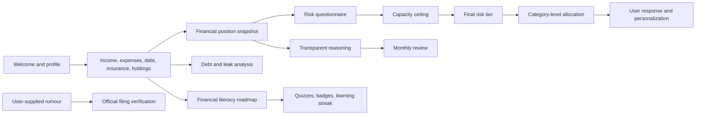
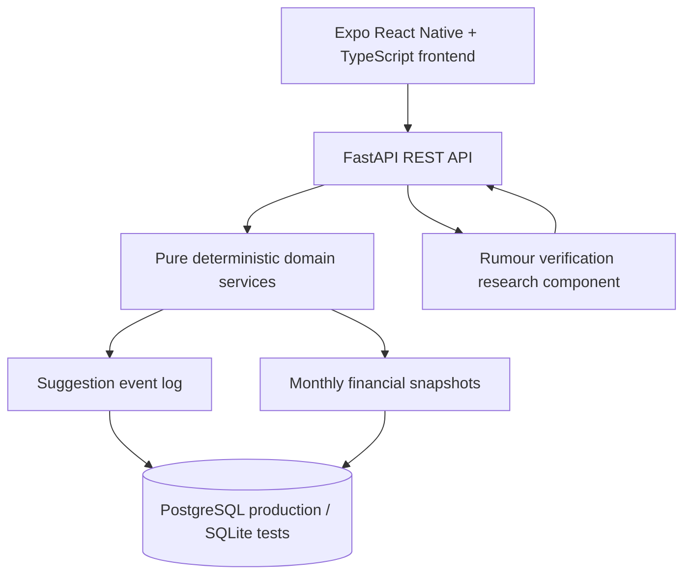

# Personal Finance Planning App for India

## Final Year Project Evaluation and PPT Guide

This project is a modular personal-finance planning application designed for
Indian users. It helps a person understand their financial position, build
financial safety, choose an appropriate risk level, create a category-level
allocation plan, identify debt and spending leaks, understand why a
recommendation was produced, verify market rumours against official filings,
and learn financial basics through a short educational roadmap.

The central idea is **ability before willingness**:

> A user may be comfortable with high risk, but the application never allows
> a recommendation to exceed what the user's current financial capacity can
> support.

This is a planning and education system, not a platform for named stock,
fund, or scheme recommendations. It does not promise returns or present past
market performance as proof of skill.

---

## 1. PPT At A Glance

| Slide | Title | Main message |
|---:|---|---|
| 1 | Project title | Personal finance planning for Indian users |
| 2 | Problem statement | Generic advice ignores cash flow, debt, liquidity, and capacity |
| 3 | Motivation | Responsible investing begins with financial hygiene and safety |
| 4 | Objectives | Measure, protect, plan, explain, educate, and improve |
| 5 | Target users | Different economic classes need different priorities |
| 6 | Proposed solution | A modular journey from onboarding to financial planning |
| 7 | System architecture | Expo frontend, FastAPI backend, database, event log, research component |
| 8 | Technology stack | Python, FastAPI, SQLAlchemy, PostgreSQL/SQLite, React Native, TypeScript |
| 9 | Core data model | Profiles, snapshots, financial records, and suggestion events |
| 10 | Module 1 | Event logging and auditability |
| 11 | Module 2 | Onboarding and financial position |
| 12 | Module 3 | Risk profile and capacity cap |
| 13 | Module 4 | Asset classification and allocation |
| 14 | Module 5 | Rumour verification against official filings |
| 15 | Module 6 | Debt and leak engine |
| 16 | Module 7 | Behaviour-based personalization |
| 17 | Module 8 | Simulated drift detection |
| 18 | Module 9 | Transparent reasoning |
| 19 | Module 10 | Financial behaviour and financial literacy |
| 20 | User journey demo | Show one user through the complete flow |
| 21 | Testing and validation | Unit, service, API, migration, and research evaluation |
| 22 | Limitations and ethics | State boundaries around advice, data, and automation |
| 23 | Future scope | Data ingestion, authentication, deployment, and larger datasets |
| 24 | Conclusion | Safer and more understandable financial planning |

### Suggested evaluation opening

"The problem is not simply that people do not know where to invest. The
problem is that investment advice is often given before understanding income,
expenses, debt, emergency savings, dependents, insurance, and time horizon.
This project creates a structured financial journey that places safety and
capacity before investment risk, while explaining every important decision."

---

## 2. Problem Statement

Many personal-finance applications focus heavily on investment products or
market returns. This creates several problems:

1. A user may be encouraged to invest before creating an emergency fund.
2. The same advice may be shown to a salaried employee, freelancer, and
   debt-burdened household even though their capacity is different.
3. A risk questionnaire measures what a user wants, but not necessarily what
   the user can financially withstand.
4. High-interest debt and recurring spending leaks may matter more than a new
   investment.
5. Users may not understand why an allocation or risk tier was produced.
6. Market rumours can influence decisions without official support.
7. Financial education is often disconnected from the user's actual journey.

### Problem definition

There is a need for an explainable, behaviour-aware, India-focused financial
planning system that begins with financial position, separates willingness
from ability, prioritizes certain improvements before uncertain returns,
supports different economic conditions, avoids product promotion, stores
decisions for auditability, teaches progressively, and distinguishes verified
information from rumours.

---

## 3. Project Objectives

### Primary objectives

- Capture income, stability, expenses, debt, insurance, cash, and holdings.
- Calculate surplus, debt burden, emergency-fund coverage, and net worth.
- Compute stated risk from a questionnaire and capacity from financial data.
- Produce `final_tier = min(stated_tier, capacity_ceiling)`.
- Map holdings to broad asset classes and create category-level allocation.
- Compare debt repayment options and identify recurring spending leaks.
- Personalize only from the user's recorded responses to suggestions.
- Show transparent reasoning from stored inputs and rules.
- Verify explicitly supplied rumours against official exchange filings.
- Reward healthy financial effort and learning, never market returns.

### Non-objectives

- No named stock, mutual fund, ETF, or scheme recommendation.
- No guarantee of returns.
- No portfolio-return leaderboard or social comparison.
- No streak for merely opening the application.
- No automated social-media rumour scraping.
- No personalized tax or investment advice without adequate information.
- No claim that simulated drift detection is ready for live users.

---

## 4. How The Project Helps Different Economic Classes

The system is designed around financial conditions rather than wealth ranking.
It does not compare users. The priority sequence changes according to each
user's own data.

| User group | Common need | How this project helps |
|---|---|---|
| Low-income or financially constrained users | Limited surplus and low emergency savings | Focuses on cash-flow visibility, essential expenses, initial buffer building, debt awareness, and avoiding unsuitable risk |
| Lower-middle-income households | Small regular surplus, dependents, limited protection | Measures dependents, insurance, buffer coverage, recurring expenses, and manageable contributions |
| Middle-income salaried users | Multiple goals, savings choices, recurring commitments | Compares liquidity needs, savings accounts, FDs/RDs, debt repayment, and category-level allocation |
| Irregular-income users | Volatile monthly cash flow | Applies stricter capacity assessment when income is irregular |
| Self-employed, business-owner, or freelance users | Variable income and higher uncertainty | Separates income stability from stated risk preference and emphasizes liquidity |
| Debt-burdened users | EMI pressure and high interest costs | Provides avalanche/snowball comparison, prepay-versus-invest framing, rate calculations, and refinance break-even |
| First-time investors | Low confidence and limited literacy | Provides progressive lessons, quizzes, risk explanations, and category-level allocation |
| Existing investors | Diversification and allocation discipline | Classifies holdings, identifies exposure, applies capacity constraints, and discourages daily reactions |

### Inclusion principle

Success is not defined as having a large portfolio. Success may mean building a
one-month buffer, reducing expensive debt, cancelling a recurring charge,
improving insurance coverage, maintaining a positive surplus, or learning an
important concept.

---

## 5. User Journey



### Typical demo flow

1. Create or select a demo user.
2. Enter income stability, cash, dependents, expenses, EMIs, insurance, and
   holdings.
3. Display the calculated financial position and monthly snapshot.
4. Answer the risk questionnaire aggressively.
5. Show that the final tier is capped by financial capacity.
6. Open allocation and show category-level percentages.
7. Open debt/leaks and show debt comparison and recurring-charge findings.
8. Open transparency and show the rule inputs behind a decision.
9. Complete a literacy lesson and answer its quiz.
10. Paste a sample rumour and show its constrained official-filing match.

---

## 6. System Architecture



### Architectural principles

- **Pure logic separated from I/O:** calculations are pure Python functions
  wherever possible, making them easy to test.
- **Service layer orchestration:** services read data, call pure functions,
  and write auditable results.
- **Versioned configuration:** questionnaire choices, capacity rules,
  allocation assumptions, leak keywords, and gamification definitions are
  explicit data.
- **Event-log replay:** suggestions and responses are stored in one structure,
  supporting transparency and personalization.
- **Portable persistence:** SQLAlchemy and Alembic support PostgreSQL and
  SQLite.
- **No cross-user ranking:** services operate on one `user_id` at a time.

---

## 7. Technology Stack

### Backend

- Python 3
- FastAPI for REST endpoints
- Pydantic for validation
- SQLAlchemy ORM
- Alembic migrations
- PostgreSQL in production
- SQLite in automated tests
- pytest for testing

### Frontend

- React Native with Expo
- TypeScript
- React Navigation
- TanStack Query for server state and cache invalidation
- Axios for HTTP communication
- Shared React Native components and theme tokens
- Fraunces and IBM Plex fonts

### Research component

- Python library/CLI under `modules/rumour_verification`
- scikit-learn TF-IDF with unigram and bigram features
- Cosine-similarity retrieval baseline
- Entity, temporal, and source-authority constraints
- Curated real filing pairs and marked synthetic distractors

---

## 8. Core Data Model

### `suggestion_event`

The central audit table. A row is created when a module produces a user-facing
suggestion or records an education completion.

Important fields include `event_id`, `user_id`, `timestamp`, `module_source`,
structured `suggested_value`, `chosen_value`, `delta`, `action_taken`,
`reason_code`, `funded`, and `market_context`.

The same event shape supports risk, allocation, debt/leak, personalization,
gamification, and education.

### `user_monthly_snapshot`

One row represents one user's financial position for one calendar month. It
stores income, surplus, cash, debt-to-income ratio, and emergency-buffer
coverage. Money uses integer paise; ratios use exact decimal values. The
`(user_id, month)` pair is unique and repeated calculations update the row.

### Onboarding tables

The onboarding model stores user profile, EMI entries, insurance policies,
holdings, expense items, closed EMI state, and removed expense state. History
is preserved so later modules can detect actions such as clearing debt or
cancelling a recurring subscription.

### Money safety rule

```text
1 INR = 100 paise
```

All monetary values use integer paise. The application avoids floating-point
money calculations and formats rupees only at display time.

---

## 9. Core Modules And Implementation

### Module 1 - Data Model and Event Logging

**Purpose:** Common data and audit foundation.

**Implementation:** SQLAlchemy models define events and monthly snapshots.
`log_suggestion_event` records a suggestion, `record_suggestion_outcome`
records a later response, and `log_monthly_snapshot` upserts the user's
monthly position. Read endpoints expose event and snapshot history.

**Value:** The project can reconstruct what was suggested, which inputs were
used, and how the user responded.

### Module 2 - Onboarding and Financial Position

**Inputs:** Income and stability, employment type, dependents, cash, expenses,
EMIs, insurance, and holdings.

**Implementation:** Pure functions calculate expenses, essential spending,
EMI outflow, outstanding principal, net worth, surplus, emergency-fund
coverage, and EMI-to-income ratio. Material edits recompute a monthly
snapshot.

**Value:** Planning starts with financial reality rather than a generic
investment profile.

### Module 3 - Risk Profiling and Capacity Ceiling

**Implementation:** A versioned questionnaire scores horizon, drawdown
reaction, experience, and goal. A separate rule table evaluates emergency
coverage, EMI burden, income stability, dependents, and other constraints.

```text
final_tier = min(stated_tier, capacity_ceiling)
```

An aggressive questionnaire cannot override low financial capacity. The
service gathers Module 2 data, computes the result, and logs it.

### Module 4 - Asset Class Mapping and Allocation

**Implementation:** Holdings are classified into cash, debt, equity, real
assets, and alternatives. Hybrid products use look-through assumptions. A
two-layer engine applies risk-ladder bounds and capital-market assumptions to
the final tier. Output is category-level and never names a product. The
allocation is logged as an event.

### Module 5 - Rumour Verification Research Component

**Purpose:** Verify an explicitly supplied market rumour against official
company/exchange filings.

**Implementation:** TF-IDF creates a retrieval baseline. The constrained
retriever adds company/entity matching, a date window after the rumour, and
official-source filtering. Results are confirmed, denied, unaddressed, or
not-yet-due. A full trace shows why candidates passed or failed.

**Boundary:** No automated social-media scraping or rumour detection.

### Module 6 - Debt and Leak Engine

**Debt features:** Avalanche versus snowball, amortization, prepay-versus-
invest framing, credit-card effective rate, and refinance break-even.

**Leak features:** Idle cash, fee/drag audit, recurring-charge detection, and
one combined recoverable amount per year.

**Implementation:** Pure calculators are combined by a service reading actual
EMIs and manually entered expenses, then logged as a `debt_leak_engine` event.

**Limitation:** The current version has no automatic bank-statement parser.

### Module 7 - Fast Feedback Personalization

**Implementation:** Replays the user's allocation responses from the event
log, uses evidence-weighted EWMA logic, bounds the offset to `[-10, +10]`
percentage points, and applies it only to displayed allocation. Module 3's
capacity ceiling is reapplied after the offset.

**Safety:** Personalization cannot modify the risk tier or display unsupported
equity exposure.

### Module 8 - Drift Detection, Simulated Only

**Implementation:** Synthetic personas provide behavioural edits and monthly
snapshots. The detector compares behavioural and capacity signal families,
requires agreement, uses asymmetric hysteresis, and freezes after a simulated
market drawdown.

**Boundary:** This is an evaluation module, not a live-user feature.

### Module 9 - Transparency Layer

**Implementation:** Reads stored events and reconstructs rule inputs and
calculations for risk, allocation, debt/leak, and personalization. It never
silently invents missing fields; incomplete events are returned with
`gap_detected` and missing-field details.

The deterministic backend uses **transparent reasoning**, while the rumour
component has a genuine retrieval-and-filter explanation trace.

### Module 10 - Behaviour-Based Gamification and Financial Literacy

**Behaviour milestones:** Emergency-buffer thresholds, rising capacity
ceiling, clearing debt, cancelling subscription-like charges, and consecutive
positive-surplus months.

The real progression mechanic is the capacity ceiling. A two-month buffer may
restrict capacity; a six-month buffer may remove that restriction. It has a
financial reason instead of being an arbitrary level.

An import-time effort-only guard rejects future milestones based on market
returns or portfolio value. There are no leaderboards, social comparisons, or
app-opening streaks.

**Financial literacy roadmap:**

1. **Financial Basics:** income, expenses, needs, wants, budgeting, cash flow,
   emergency funds, inflation, and interest.
2. **Financial Safety:** buffers, insurance, high-interest debt, credit scores,
   subscriptions, and document organisation.
3. **Banking and Saving:** savings accounts, FDs, RDs, sweep-in FDs, liquidity,
   interest rates, tax on interest, and post-tax comparisons.
4. **Investing Basics:** saving versus investing, risk, volatility, equity,
   debt, mutual funds, index funds, ETFs, gold, government securities,
   diversification, allocation, and SIPs.
5. **Taxes and Retirement:** income tax, tax-saving investments, capital gains,
   EPF, PPF, NPS, retirement planning, and pre-tax versus post-tax returns.

Each topic has a multiple-choice quiz with server-side answer validation,
feedback, and retry support. Badges represent learning milestones. Learning
streaks use lesson or quiz completion dates, not app opening. A checklist
covers financial foundation, savings, investing, and literacy.

---

## 10. API Surface

| Area | Representative endpoints |
|---|---|
| Health | `GET /health` |
| Authentication | `/auth/...` |
| Events and snapshots | `/users/{user_id}/events`, `/snapshots` |
| Onboarding | `/users/{user_id}/profile`, `/expenses`, `/emis`, `/insurance`, `/holdings` |
| Risk profile | `/risk-profile/questionnaire`, `/users/{user_id}/risk-profile` |
| Allocation | `/users/{user_id}/allocation` |
| Debt and leaks | `/users/{user_id}/debt-leak` |
| Personalization | `/users/{user_id}/personalization` |
| Transparency | `/users/{user_id}/transparency` |
| Gamification | `/users/{user_id}/gamification/check`, `/history` |
| Education | `/users/{user_id}/gamification/education`, `/education/complete` |
| Rumour verification | `/users/{user_id}/rumour-verification` |

Interactive FastAPI documentation is available at:

```text
http://127.0.0.1:8000/docs
```

---

## 11. Frontend Structure

- **Home:** financial position and summary metrics.
- **Plan:** risk questionnaire, capped risk profile, and allocation.
- **Insights:** debt, leaks, personalization, and transparency.
- **Verify:** explicit rumour verification.
- **Progress:** milestones, literacy roadmap, quizzes, checklist, badges, and
  learning streak.
- **Profile:** edit income, expenses, EMIs, insurance, and holdings.

Shared components provide cards, buttons, text styles, choices, metrics,
charts, empty/error states, skeleton loading, and reasoning trees. Theme
tokens centralize typography, spacing, colors, and dark-mode variants.
TanStack Query invalidates related data after mutations to prevent stale
financial screens.

---

## 12. Testing And Validation

The backend suite covers financial calculations, onboarding, risk scoring,
capacity caps, asset classification, allocation, debt amortization, leak
detection, event logging, personalization, simulated drift, transparency,
rumour verification, gamification, education, and Alembic migrations.

The rumour component compares an unconstrained TF-IDF baseline with the same
ranking plus entity, temporal, and source-authority constraints. It reports
MRR, hit rate, and precision at `k`.

```powershell
# Backend
cd backend
pip install -r requirements.txt
alembic upgrade head
pytest
uvicorn app.main:app --reload

# Frontend, in a second terminal
cd frontend
npm install
npx expo start

# Research component
cd modules/rumour_verification
pip install -r requirements.txt
pytest
python demo.py "Paste an explicitly supplied rumour here" --date 2025-02-11 --full-trace
```

Tests use SQLite, so a local PostgreSQL server is not required for automated
testing.

---

## 13. Ethical Design And Limitations

- Capacity caps stated risk preference.
- Allocation avoids named-product promotion.
- Money uses integer paise and exact decimal ratios.
- Gamification excludes market outcomes and app engagement.
- There are no leaderboards or comparisons of personal financial positions.
- Tax content is time-sensitive and circumstance-dependent.
- Rumour verification requires explicit input and official-source filtering.
- Drift detection is simulated only.
- Transparency reports missing inputs instead of fabricating them.
- The leak engine analyses manual expenses, not bank statements.
- Production authentication, authorization hardening, monitoring, and
  deployment security require further work.
- The application supports planning and education; it is not a substitute for
  a qualified financial, tax, legal, or insurance professional.

---

## 14. Future Scope

- Secure production authentication and authorization.
- Bank/account aggregation with explicit consent.
- Statement parsing and transaction categorization.
- Larger, continuously reviewed official-filing corpus.
- Multilingual financial-literacy content for Indian users.
- Offline-first lessons and accessibility improvements.
- Current-rule tax verification with user-controlled tax profile.
- Production observability, backups, rate limiting, and deployment automation.
- More validation before any live drift research.
- Goal scenario analysis with uncertainty ranges instead of guaranteed returns.

---

## 15. Evaluation Questions And Short Answers

### Why is this better than a normal investment recommender?

It begins with financial position and safety. Building an emergency fund or
paying expensive debt may be more appropriate than taking investment risk.

### Why separate stated risk and capacity?

A questionnaire measures willingness; capacity measures ability. A user can
want high risk while lacking a buffer or carrying excessive EMI burden.

### Why category-level output?

The project focuses on suitability, diversification, and explainability rather
than product promotion.

### Why use an event log?

It provides an auditable history of suggestions, inputs, actions, and outcomes,
which also supports transparency and personalization.

### Why limit gamification?

Personal finance should not reward luck, wealth, risky investing, or constant
app usage. The project rewards controllable effort and education.

### Is the system using AI?

The main planning modules are deterministic and rule-based. The rumour
component uses TF-IDF retrieval and structured filters. The project does not
claim that weighted rules are explainable AI.

### How is correctness tested?

Pure functions have unit tests, orchestration has service tests, routes have
API tests, migrations have schema tests, and rumour retrieval has evaluation
tests. Capacity caps and effort-only milestones are directly tested.

---

## 16. Repository Structure

```text
backend/
  app/api/                 FastAPI routes
  app/models/              SQLAlchemy models
  app/schemas/             Pydantic schemas
  app/services/            Domain logic and orchestration
  migrations/              Alembic history
  tests/                   Backend tests

frontend/
  src/api/                 HTTP clients, types, query keys
  src/components/          Shared UI components
  src/hooks/               TanStack Query hooks
  src/navigation/          Stack and tab navigation
  src/screens/             Product screens
  src/theme/               Design tokens

modules/rumour_verification/
  src/                     Retrieval, constraints, labels, trace
  data/                    Dataset and filing corpus
  eval/                    Research evaluation scripts
  demo.py                  CLI demonstration
```

---

## 17. Conclusion

The project presents personal finance as a staged decision process:

```text
Understand financial position
        -> build safety
        -> measure capacity
        -> set an appropriate risk tier
        -> plan by asset category
        -> address debt and leaks
        -> explain decisions
        -> verify information
        -> learn and improve financial behaviour
```

Its contribution is the combination of financial safety, deterministic
capacity-aware planning, event-based auditability, transparent reasoning,
responsible gamification, and beginner-friendly financial education in one
modular system for Indian users.
